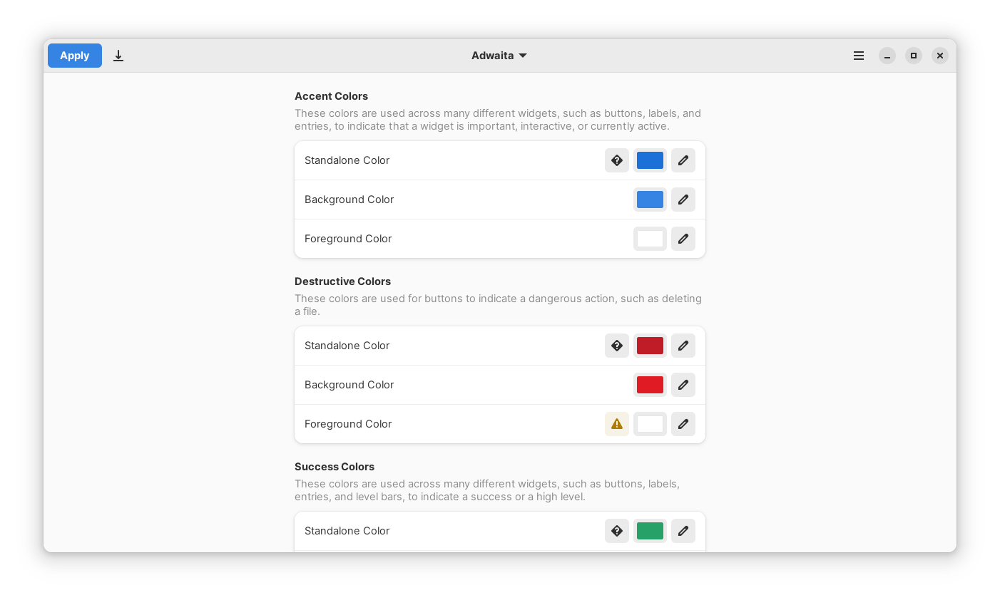
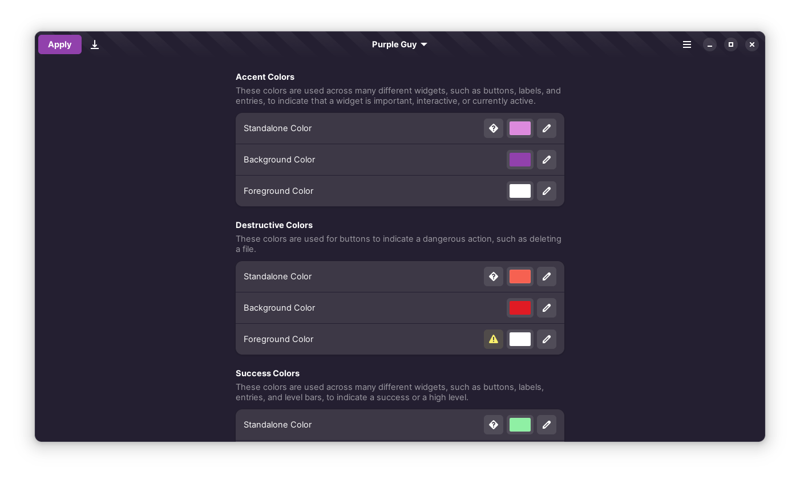
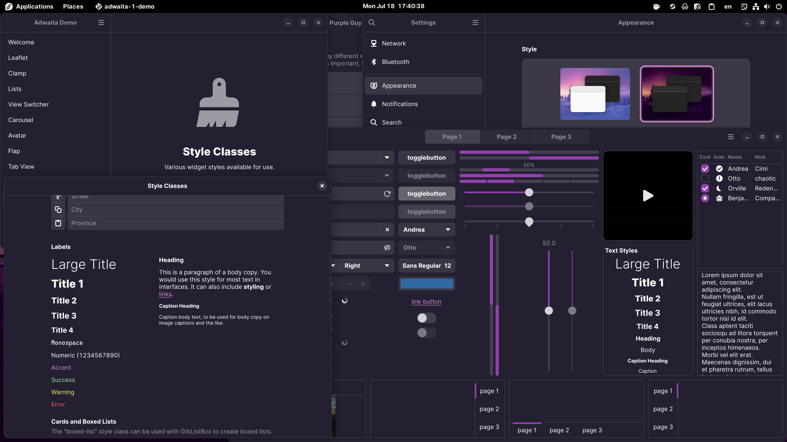

# Adwaita Manager
Change the look of Adwaita, with ease

Adwaita Manager (AdwCustomizer) is a tool for customizing Libadwaita applications and the adw-gtk3 theme.

  
More screenshots

  
  
  
  

## Building and Installing
1. Open GNOME Builder
2. Press the "Clone Repository" button in the bottom of window
3. Paste this in "Repository URL" `https://github.com/ArtyIF/AdwCustomizer.git`
4. Press the "Build" button (hammer in the header bar)
5. Press on the status panel and click "Export Bundle" to export the app as a Flatpak bundle
6. Install the bundle with `flatpak install <path to bundle>` or through a GUI application (like GNOME Software and KDE Discover)

> **WARNING**: The project currently uses the `master` version of `org.gnome.Platform` and depends on some `Adw` classes that are not yet available in the latest stable version of `org.gnome.Platform` (42 at the time of writing). Flathub only ships stable versions of packages, so make sure you have a Flatpak repository that ships the needed dependency versions before installing.

## Setup Tutorial

### Libadwaita applications
No additional setup is required for native Libadwaita applications.

For Flatpak Libadwaita applications, you need to override their permissions:
- Run `sudo flatpak override --filesystem=xdg-config/gtk-4.0` or
- Use [Flatseal](https://github.com/tchx84/Flatseal) and adding `xdg-config/gtk-4.0` to **Other files** in the **Filesystem** section of **All Applications**

### Vanilla GTK 4 applications
Use [this guide](https://github.com/lassekongo83/adw-gtk3/blob/main/gtk4.md) to theme vanilla GTK 4 applications.

### GTK 3 applications
- Install and apply the [adw-gtk3](https://github.com/lassekongo83/adw-gtk3#readme) theme (don't forget to install the Flatpak package!)
- For Flatpak applications, you need to override their permissions:
  - Run `sudo flatpak override --filesystem=xdg-config/gtk-3.0` or
  - Use [Flatseal](https://github.com/tchx84/Flatseal) and adding `xdg-config/gtk-3.0` to **Other files** in the **Filesystem** section of **All Applications**

## Roadmap
This tool is currently WIP, but it already has a plenty of features and is very usable. Below is the roadmap, where all the checked features are already implemented:

- [x] Customize named colors, either with a color picker or with text
- [x] Explanations for some named colors
- [x] Partial theme preview
- [x] Built-in presets for Adwaita and Adwaita Dark (based on default libadwaita colors)
- [x] Apply changes to libadwaita, GTK4 (with extracted libadwaita theme) and GTK3 (with the adw-gtk3 theme) applications
- [x] Load and create custom presets
- [x] View adw-gtk3's support of variables
- [x] View parsing errors
- [x] Customize palette colors
- [ ] Add custom CSS code
- [ ] Normalize color variables to hexadecimal or `rgba(r, g, b, a)` format
- [ ] Secure the code
- [ ] Release on Flathub
- [ ] Full theme preview
- [ ] Customize GNOME Shell
- [ ] Customize GDM
- [ ] Customize Firefox GNOME theme
- [ ] Localization

## Donations
I am broke, and I live in Russia (I don't support the "military operation" currently going on), so if anyone wants to help me, the only way right now is cryptocurrency:
- Bitcoin: `1FrvFbfqWEZepmuH2Bayo8tSvHEr6NnANJ`
- Ethereum/ERC20: `0x37e03C589F28831bD78C4B41Bf866e8ddB2bed3E`
- Binance Coin/BEP2: `bnb1aewh72p3u80qd8ufywhseuvjupy9mhxtrmwnm4` (no memo required, type anything in there if it's required by the exchange)
- Solana: `Brs84xPGUjDJhCi7GH4EHRQi4dXvWFC6kYy9jY8oQpar`

If you're in Russia, then send me an email to artyomisflash@mail.ru, and I'll send you my details (Tinkoff card number or SberBank/SBP/Qiwi/YooMoney/Megafon phone number)
